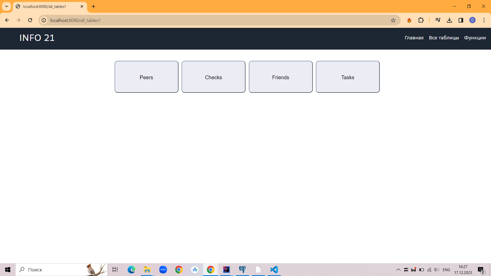
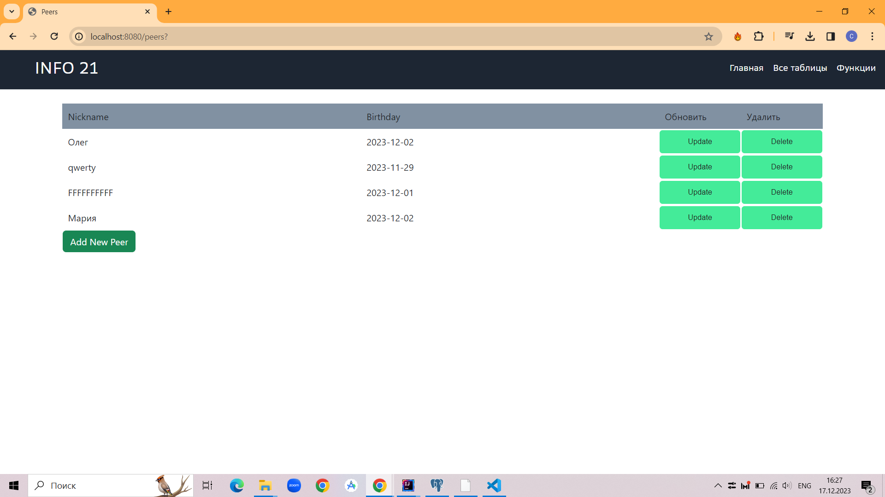
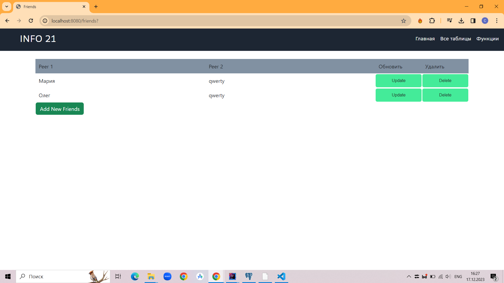
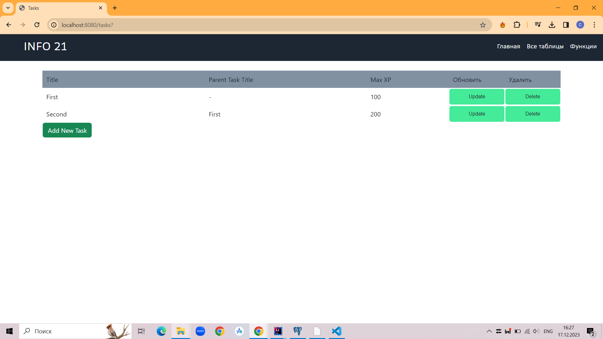

# Info

Info - это Web-приложение, поддерживающее выполнение CRUD-операций:
- создается база данных с таблицами Peers, Friends, Tasks, Checks;
- рендеринг страниц осуществляется на стороне сервера (технология Server-Side Rendering);  
- Java, Spring Boot, MVC, Hibernate;  
- HTML, CSS.

Видео работающего приложения:  
https://disk.yandex.ru/i/nhAuz13GQF1EPQ

